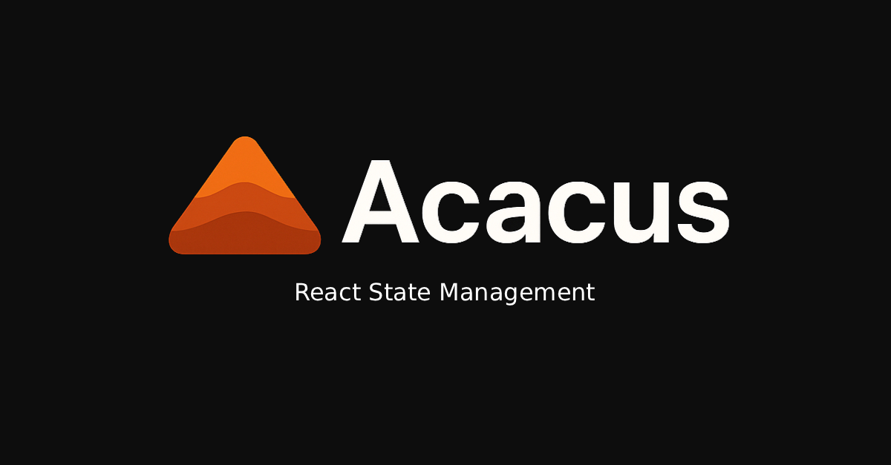

# Acacus



[](https://badge.fury.io/js/acacus)
[](https://www.npmjs.com/package/acacus)

[](https://www.npmjs.com/package/acacus)
[](https://www.npmjs.com/package/acacus)
[](https://github.com/NourAlzway/acacus/actions/workflows/test-and-build.yml)
[](https://codecov.io/gh/NourAlzway/acacus)
[](https://opensource.org/licenses/MIT)

Acacus is a lightweight, type-safe state management library for React applications. It provides a simple and intuitive API for managing both synchronous and asynchronous state, making it easier to build and maintain complex UIs with excellent performance characteristics.

## Features

- **Type-Safe**: Full TypeScript support with automatic type inference
- **Async-First**: Built-in loading states, error handling, and data management for async operations
- **Performance Optimized**: Selector-based subscriptions prevent unnecessary re-renders
- **Simple API**: Clean get/use pattern separates state access from action access
- **Effects System**: Built-in subscription system for side effects and data synchronization
- **Zero Dependencies**: No runtime dependencies except React (18+)
- **Tree Shakeable**: Optimized bundle size with ESM support

## Installation

```bash
npm install acacus
```

## Quick Start

```typescript
import { createStore } from 'acacus';

// Define your state type
interface CounterState {
  count: number;
}

// Create a store with initial state
const counterStore = createStore<CounterState>({ count: 0 })
  .action('increment', state => ({ count: state.count + 1 }))
  .action('decrement', state => ({ count: state.count - 1 }))
  .action('reset', () => ({ count: 0 }))
  .build();

// Use in React components
function Counter() {
  // Access state - triggers re-render when count changes
  const count = counterStore.get(state => state.count);

  // Access actions - doesn't trigger re-renders
  const increment = counterStore.use(actions => actions.increment);
  const decrement = counterStore.use(actions => actions.decrement);

  return (
    <div>
      <p>Count: {count}</p>
      <button onClick={increment}>+</button>
      <button onClick={decrement}>-</button>
    </div>
  );
}
```

## Core Concepts

### get/getAsyncStatus/use Pattern

Acacus separates state access from action access to optimize performance:

- **`store.get(selector)`**: Access state with automatic re-renders when selected state changes
- **`store.getAsyncStatus(actionName)`**: Access the async status of an action (loading, error, data) with re-renders on status changes
- **`store.use(selector)`**: Access actions without triggering re-renders

```typescript
function MyComponent() {
  // Only re-renders when `count` changes, not other state properties
  const count = store.get(state => state.count);

  // Accessing actions doesn't cause re-renders
  const { increment, decrement } = store.use(actions => ({
    increment: actions.increment,
    decrement: actions.decrement,
  }));
}
```

### Async Actions

Acacus provides first-class support for async operations with automatic loading states:

```typescript
interface ApiState {
  posts: Post[];
  users: User[];
}

const apiStore = createStore<ApiState>({ posts: [], users: [] })
  .asyncAction('fetchPosts', async () => {
    const response = await fetch('/api/posts');
    return response.json();
  })
  .asyncAction('createPost', async (state, postData: CreatePostData) => {
    const response = await fetch('/api/posts', {
      method: 'POST',
      body: JSON.stringify(postData)
    });
    return response.json();
  })
  .build();

function PostList() {
  // Access async status - clean and intuitive
  const fetchPostsStatus = apiStore.getAsyncStatus('fetchPosts');
  const { loading, error, data: posts } = fetchPostsStatus;

  const fetchPosts = apiStore.use(actions => actions.fetchPosts);

  if (loading) return <div>Loading...</div>;
  if (error) return <div>Error: {error.message}</div>;

  return (
    <div>
      {posts?.map(post => <div key={post.id}>{post.title}</div>)}
      <button onClick={fetchPosts}>Refresh</button>
    </div>
  );
}
```

### Effects and Subscriptions

Use subscriptions for side effects and data synchronization:

```typescript
// Subscribe to state changes
const unsubscribe = store.subscribe((state, prevState) => {
  // Save to localStorage when posts change
  if (state.posts !== prevState.posts) {
    localStorage.setItem('posts', JSON.stringify(state.posts));
  }

  // Sync async results with local state
  if (state.fetchPosts?.data && !prevState.fetchPosts?.data) {
    const setPosts = store.use(actions => actions.setPosts);
    setPosts(state.fetchPosts.data);
  }
});

// Cleanup subscription
return unsubscribe;
```

## Advanced Usage

### Complex State Management

```typescript
interface AppState {
  users: User[];
  selectedUserId: number | null;
  searchTerm: string;
  filters: {
    showActive: boolean;
    sortBy: 'name' | 'email';
  };
}

const appStore = createStore<AppState>({
  users: [],
  selectedUserId: null,
  searchTerm: '',
  filters: { showActive: true, sortBy: 'name' },
})
  // Sync actions
  .action('selectUser', (state, userId: number) => ({ selectedUserId: userId }))
  .action('setSearchTerm', (state, term: string) => ({ searchTerm: term }))
  .action('toggleActiveFilter', state => ({
    filters: { ...state.filters, showActive: !state.filters.showActive },
  }))

  // Async actions
  .asyncAction('fetchUsers', async () => {
    const response = await fetch('/api/users');
    return response.json();
  })
  .asyncAction('deleteUser', async (state, userId: number) => {
    await fetch(`/api/users/${userId}`, { method: 'DELETE' });
    return userId;
  })

  .build();
```

### Error Handling

Async actions automatically handle errors and provide them in the state:

```typescript
function UserManager() {
  const deleteUserStatus = store.getAsyncStatus('deleteUser');
  const deleteUser = store.use(actions => actions.deleteUser);

  const handleDelete = async (userId: number) => {
    try {
      await deleteUser(userId);
      // Success - handle UI updates
    } catch (error) {
      // Error is automatically captured in deleteUserStatus.error
      console.error('Delete failed:', deleteUserStatus.error);
    }
  };
}
```

## TypeScript Support

Acacus provides excellent TypeScript support with full type inference:

```typescript
// State and actions are fully typed
const store = createStore({ count: 0 })
  .action('increment', state => ({ count: state.count + 1 })) // state.count is number
  .asyncAction('fetchData', async () => {
    return { data: 'hello' }; // Return type is automatically inferred
  })
  .build();

// Usage is type-safe
const count: number = store.get(state => state.count);
const increment: () => void = store.use(actions => actions.increment);
const asyncStatus: AsyncState<{ data: string }> =
  store.getAsyncStatus('fetchData');
```

## Development

### Getting Started

1. **Clone the repository**

   ```bash
   git clone https://github.com/NourAlzway/acacus.git
   cd acacus
   ```

2. **Install dependencies**

   ```bash
   npm install
   ```

3. **Run examples**

   ```bash
   cd examples
   npm run dev
   ```

### Scripts

- `npm run examples` - Start development server with examples
- `npm run build` - Build the library for production
- `npm run lint` - Run ESLint to check code quality
- `npm run test` - Run tests with Jest
- `npm run typecheck` - Run TypeScript type checks

## API Reference

### `createStore<T>(initialState: T)`

Creates a new store with the given initial state.

**Returns**: Store builder instance

### Store Builder Methods

#### `.action(name, actionFn)`

Adds a synchronous action to the store.

- `name` - Action name
- `actionFn` - Function that receives `(state, ...args)` and returns partial state

#### `.asyncAction(name, asyncFn)`

Adds an async action with automatic loading/error/data state management.

- `name` - Action name
- `asyncFn` - Async function that receives `(state, ...args)` and returns a Promise

#### `.build()`

Builds and returns the final store instance.

### Store Instance Methods

#### `.get(selector)`

Access state with automatic React re-renders when selected state changes.

- `selector` - Function that receives full state and returns selected portion

#### `.use(selector)`

Access actions without triggering re-renders.

- `selector` - Function that receives actions object and returns selected actions

#### `.getAsyncStatus(actionName)`

Access async action status with automatic React re-renders when status changes.

- `actionName` - Name of the async action to get status for

**Returns**: `{loading: boolean, error: Error | null, data: T | null}`

#### `.subscribe(listener)`

Subscribe to state changes.

- `listener` - Function that receives `(currentState, previousState)`

**Returns**: Unsubscribe function

### Types

#### `AsyncState<T>`

```typescript
interface AsyncState<T> {
  loading: boolean;
  error: Error | null;
  data: T | null;
}
```

## Examples

Check out the `/examples` directory for complete working examples:

- **Counter** - Basic state management with actions
- **User Management** - Complex state with filtering and search
- **Async Operations** - API integration with loading states
- **Effects & Subscriptions** - Side effects and data persistence

## Contributing

We welcome contributions! Please see [CONTRIBUTING.md](CONTRIBUTING.md) for details.

### Development Guidelines

- Follow the code style enforced by Prettier and ESLint
- Write clear, concise commit messages following [Conventional Commits](https://conventionalcommits.org/)
- Add tests for new features
- Update documentation as needed

### Reporting Issues

- Use the issue templates for bug reports and feature requests
- Provide clear reproduction steps for bugs
- Include relevant environment details

## License

MIT License - see [LICENSE](LICENSE) for details.
